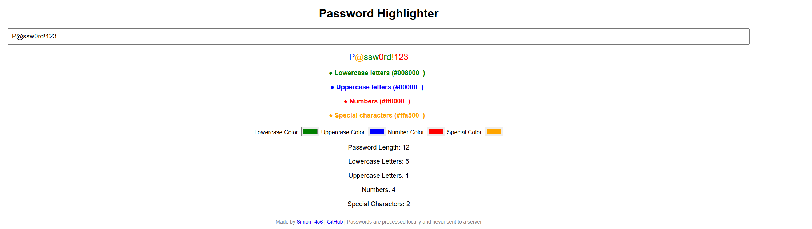

# Password Highlighter

Password Highlighter is a simple HTML tool that helps you visualize the different types of characters in a password. It highlights lowercase letters, uppercase letters, numbers, and special characters in customizable colors. This tool runs entirely in your browser and ensures no data is sent to a server.

## Features

- Dynamically highlights:
  - **Lowercase letters** (default: green)
  - **Uppercase letters** (default: blue)
  - **Numbers** (default: red)
  - **Special characters** (default: orange)
- Allows customization of highlight colors using a built-in color picker.
- Real-time updates as you type.
- Displays live statistics:
  - Password length
  - Count of lowercase letters, uppercase letters, numbers, and special characters.

## Demo

Copy the `index.html` file to any web server or open it directly in your browser to use the tool.

## Usage

1. Clone the repository or download the `index.html` file.
2. Open the file in your favorite browser.
3. Paste or type your password into the input field.
4. View the highlighted password with its components in their respective colors.
5. Use the color pickers to customize the colors for each type of character.
6. Review the live statistics to analyze your password's composition.

## Screenshot


## Installation

No installation is required. Simply download and open the `index.html` file in any modern browser.

## Development

The project is written in plain HTML, CSS, and JavaScript. If you'd like to make changes:

1. Clone the repository:

   ```bash
   git clone https://github.com/simont456/password-highlighter.git
   ```

2. Edit the `index.html` file using your preferred text editor.
3. Test your changes by opening the file in a browser.

## Contributing

Feel free to submit issues or pull requests if you have ideas for improvements or new features.

## License

This project is open-source and available under the [MIT License](LICENSE).

---

### Made by SimonT456

> Passwords are processed locally and never sent to a server.
